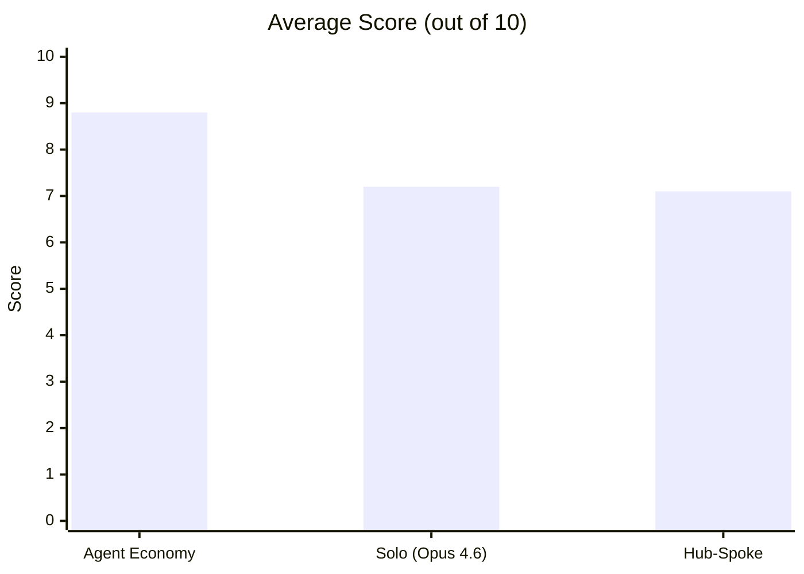

# Hub vs Spoke

When you have access to multiple LLMs, how should you coordinate them? This repo tests three strategies on the same set of tasks and measures what you get for your money.

## Results (Feb 2026)



| Condition | Avg Score | Pass Rate | Cost | Score per Dollar |
|---|---|---|---|---|
| **Agent Economy** | **8.8** | **9/9** | $0.41 | 21.2 |
| Solo (Opus 4.6) | 7.2 | 6/9 | $0.31 | 23.3 |
| Hub-Spoke | 7.1 | 7/9 | $1.00 | 7.1 |

The competitive market beat both the hierarchical setup and the best single model. Hub-spoke cost 2.4x more than the market for a lower score. The solo baseline was cheapest but least consistent.

<details>
<summary>Per-task scores</summary>

| Task | Agent Economy | Hub-Spoke | Solo |
|---|---|---|---|
| coding-001 (interval store) | 8 | 9 | **10** |
| coding-002 (debug sliding window) | **10** | **10** | **10** |
| coding-003 (refactor monolith) | 7 | **9** | 6 |
| reasoning-001 (combinatorics) | **10** | 0 | 0 |
| reasoning-002 (constraint scheduling) | **10** | **10** | 9 |
| reasoning-003 (causal chain) | 9 | 9 | 9 |
| synthesis-001 (distributed consistency) | **9** | 8 | 6 |
| synthesis-002 (monorepo debate) | **9** | 7 | 7 |
| synthesis-003 (multi-audience Raft) | 7 | 2 | **8** |

The market's weakest score was a 7. Hub-spoke and solo both had at least one 0.

</details>

<details>
<summary>Shadow counterfactual analysis</summary>

On 3 tasks (one per category), all three market workers independently answered the same question after the market run. This lets us check whether the market's routing was optimal.

- **coding-002**: Market picked GPT-5.2 (score 9), but Opus 4.6 would have scored 10. Regret: 1 point.
- **reasoning-002**: Market picked Opus 4.6 (score 10). Correct — best possible pick.
- **synthesis-001**: Market picked Opus 4.6 (score 9), tied with GPT-5.2 (score 9). No regret.

Routing accuracy: 2/3 optimal. The one miss cost a single point.

</details>

## The three topologies

### Solo

One model answers the task directly. No decomposition, no coordination, no overhead. This is the control — it tells you whether coordination actually helps or whether you're just paying for extra calls.

### Hub-Spoke

An orchestrator (Opus 4.5) decomposes the task, assigns subtasks to three GPT-5.2 workers, synthesises their outputs, then one worker red-teams the synthesis and the hub revises. About 7 LLM calls per task.

```
         ┌─────────┐
    ┌───►│ Spoke 0 │───┐
    │    └─────────┘   │
    │    ┌─────────┐   │    ┌──────────┐    ┌────────┐
────┼───►│   Hub   │◄──┼───►│Red-team  │───►│Revision│
    │    └─────────┘   │    └──────────┘    └────────┘
    │    ┌─────────┐   │
    └───►│ Spoke 2 │───┘
         └─────────┘
```

### Agent Economy

Three models (GPT-5.2, Opus 4.6, GPT-5-mini) compete through [agent-economy](https://github.com/strangeloopcanon/agent-economy)'s clearinghouse. For each task, all three bid; the engine picks a winner based on bid confidence and reputation; the winner produces an answer; an LLM judge verifies it. Reputation develops across the full 9-task session — early failures reduce a model's chances of winning later tasks.

```
    ┌─────────┐   bid    ┌──────────────┐   assign   ┌────────┐
    │ GPT-5.2 │─────────►│              │────────────►│ Winner │
    └─────────┘          │ Clearinghouse│             └───┬────┘
    ┌─────────┐   bid    │   Engine     │                 │
    │Opus 4.6 │─────────►│              │    verify       ▼
    └─────────┘          │  reputation  │◄────────── ┌────────┐
    ┌─────────┐   bid    │  tracking    │            │ Judge  │
    │GPT-mini │─────────►│              │            └────────┘
    └─────────┘          └──────────────┘
```

In this run, Opus 4.6 won 7 of 9 tasks. GPT-5-mini never won. Reputation at session end: Opus 4.6 = 1.02, GPT-5.2 = 0.72, GPT-5-mini = 1.00.

## Setup

Python 3.11+. [`uv`](https://docs.astral.sh/uv/) recommended.

```bash
git clone https://github.com/strangeloopcanon/hub-vs-spoke.git
cd hub-vs-spoke
uv pip install -e ".[dev]"

cp .env.example .env
# Fill in OPENAI_API_KEY and ANTHROPIC_API_KEY
```

## Running

```bash
# Preview the matrix without calling any APIs
python scripts/run_benchmark.py --dry-run

# Full run: 3 conditions × 9 tasks + shadow counterfactuals
python scripts/run_benchmark.py --output results/yolo_run.jsonl

# Analyse results
python scripts/analyse_results.py results/yolo_run.jsonl --csv results/summary.csv

# Unit tests (no API keys needed)
pytest tests/unit/ -v
```

<details>
<summary>CLI options</summary>

```bash
# Single category
python scripts/run_benchmark.py --category coding

# Single config
python scripts/run_benchmark.py --config agent-economy

# Multiple reps
python scripts/run_benchmark.py --reps 3

# Adjust budget
python scripts/run_benchmark.py --budget-tokens 30000 --budget-turns 20
```

</details>

## Caveats

Nine tasks is a pilot. Bootstrap 95% CIs: market [8.0, 9.4], solo [5.1, 8.9], hub-spoke [4.8, 9.1]. The intervals overlap — this is directional evidence, not proof. The judge (GPT-5.2) also participates as a market worker. The market's dominance partly reflects Opus 4.6 winning most bids — a task set requiring genuine specialisation could shift things.

## Next steps

These are concrete things to do next, roughly in priority order. Each is self-contained — pick one and run with it.

1. **Statistical power.** Run 3–5 reps of the current setup. With 27–45 observations per condition instead of 9, the bootstrap CIs tighten enough to make real claims. Cost: ~$5–10. Change `--reps 3` and go.

2. **Judge independence.** GPT-5.2 currently serves as both a market worker and the evaluation judge. Replace the judge with a model that doesn't participate (e.g. Claude Sonnet 4.5 or a separate GPT-5.2 instance with a different system prompt). Then check whether scores change — if they do, we had a bias.

3. **Harder tasks.** The current 9 tasks are medium-to-hard but the market scored 7+ on all of them. Add tasks where single models reliably fail: multi-step code generation with test suites, long-context synthesis (10k+ word inputs), or tasks requiring domain knowledge that varies by model. The interesting question is whether the market routes hard tasks better than easy ones.

4. **Structured bids.** Right now agent-economy's bidder generates a single confidence score. Extend it to structured bids: `{p_success, expected_tokens, plan, risks}`. Then track calibration — does stated confidence predict actual performance? This is the data needed to know if market-based routing can be trusted.

5. **Longer sessions.** Run 30–50 tasks in one market session instead of 9. The reputation mechanism is the market's main advantage over simple routing, but 9 tasks barely exercises it. With 50 tasks, you can plot reputation trajectory over time and see whether it converges to something meaningful.

6. **Cost-optimised routing.** Add a condition where the market uses a cost-aware scoring function: `score = quality / cost` instead of pure quality. See if this routes cheap tasks to GPT-5-mini (which currently never wins) while preserving quality on hard tasks.

<details>
<summary>Project structure</summary>

```
src/hub_vs_spoke/
├── types.py                Core data models (Message, Usage, Turn, TopologyResult)
├── config.py               Settings via pydantic-settings (.env)
├── providers/
│   ├── base.py             LLMProvider protocol
│   ├── openai_provider.py  OpenAI chat completions
│   └── anthropic_provider.py  Anthropic messages
├── agents/
│   ├── agent.py            Agent: provider + history + cost tracking
│   └── mock_agent.py       MockAgent for tests (no network)
├── topologies/
│   ├── base.py             Topology protocol
│   ├── _shared.py          Subtask parsing, retry logic, result building
│   ├── hub_spoke.py        Hub-and-spoke + red-team review
│   ├── solo.py             Solo baseline
│   └── market.py           Agent-economy clearinghouse wrapper
├── tasks/
│   ├── base.py             Task model, registry, eval methods
│   ├── coding.py           3 coding tasks (implement, debug, refactor)
│   ├── reasoning.py        3 reasoning tasks (probability, scheduling, causal)
│   └── synthesis.py        3 synthesis tasks (comparison, debate, multi-audience)
└── evaluation/
    ├── judge.py            LLM-as-judge (absolute + pairwise)
    ├── deterministic.py    Exact match, regex, code execution, function-call check
    ├── cost.py             Token-to-USD pricing
    └── reliability.py      Success/error rate scoring

scripts/
├── run_benchmark.py        Benchmark runner (solo, hub-spoke, market + shadows)
└── analyse_results.py      Analysis: calibration, routing accuracy, bootstrap CIs

tests/
├── unit/                   68 tests, no network, < 2 seconds
└── integration/            Pipeline + live API tests
```

</details>

<details>
<summary>Adding tasks</summary>

Create a task in the relevant file (e.g. `src/hub_vs_spoke/tasks/coding.py`):

```python
Task(
    task_id="coding-004",
    category=TaskCategory.CODING,
    prompt="Your task description.",
    eval_method=EvalMethod.LLM_JUDGE,
    eval_rubric="What counts as good. Length alone is not quality.",
    difficulty="hard",
)
```

Append it to the category list and it auto-registers on import.

</details>
