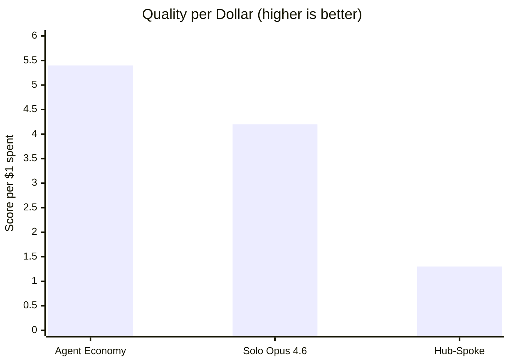
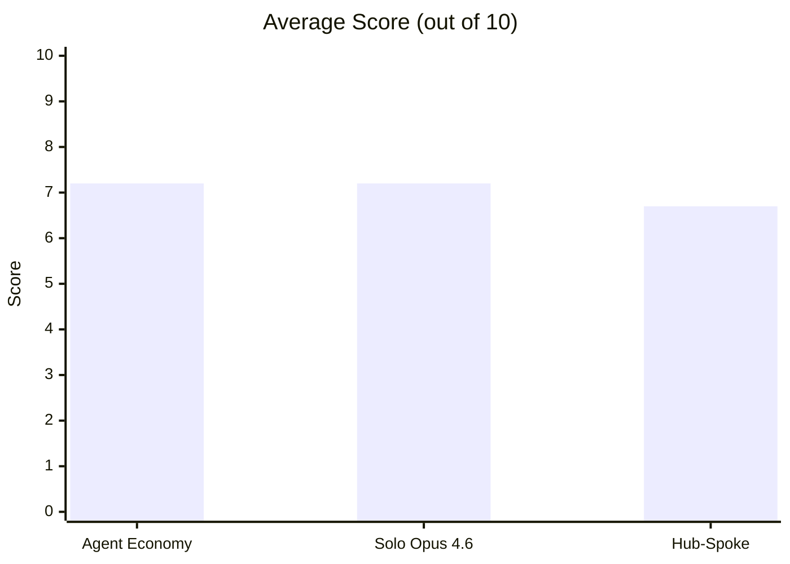
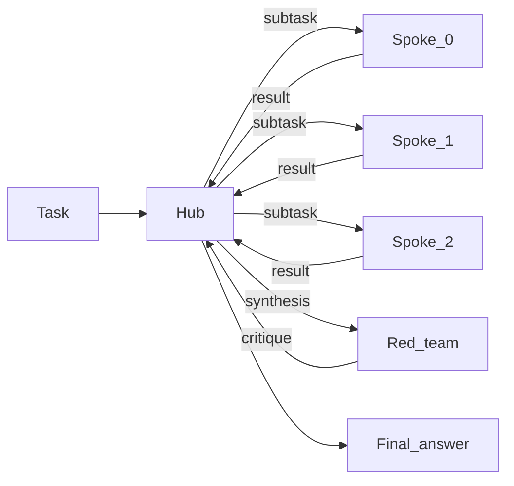
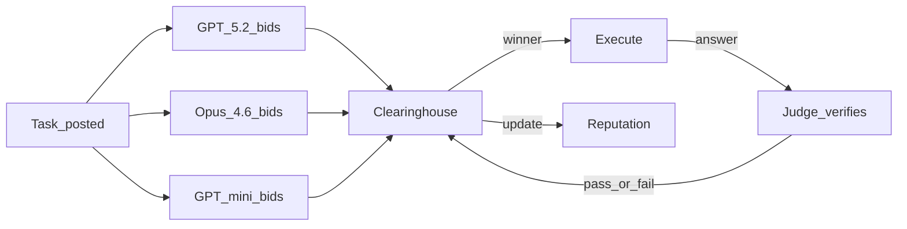
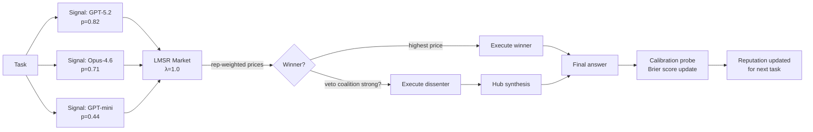

# Can agents be orchestrated via futarchy?

> **Fork of [strangeloopcanon/hub-vs-spoke](https://github.com/strangeloopcanon/hub-vs-spoke).**
> This fork adds a fourth topology — **Futarchy** — based on Hanson's logarithmic market-scoring rule (LMSR). See [Futarchy topology](#futarchy-topology-new) below.

---

If you can call multiple LLMs, is it better to use one strong model, have one orchestrate the others, let them compete for work, or let them *bet on their own probability of success*? This repo runs all four approaches on the same tasks and tracks what each produces for what it costs.

## Results

The results below are from the 15-task, 3-repetition full run saved in `results/hard_run.jsonl` and `results/hard_summary.csv`.

### Full run (15 tasks, 3 reps, 135 scored runs — original three topologies)





| Condition | Avg Score | Pass Rate | Total Cost | Score/$ |
|---|---|---|---|---|
| **Agent Economy** | 7.2 | 76% (34/45) | **$1.34** | **5.4** |
| Solo (Opus 4.6) | 7.2 | 73% (33/45) | $1.69 | 4.2 |
| Hub-Spoke | 6.7 | 67% (30/45) | $5.33 | 1.3 |

The competitive market matched the best single model on quality while costing 21% less than solo in the full run. Hub-spoke cost about 4x more than the market and a little over 3x more than solo for a lower score. Bootstrap 95% CIs on mean score: market [6.1, 8.2], solo [6.3, 8.0], hub-spoke [5.8, 7.5] — the intervals overlap, so the overall averages are not statistically distinguishable. The category-level patterns below are where the real separation lives.

> **Futarchy results**: Pending — run `python scripts/run_benchmark.py --config futarchy` to generate and add them here.

### When the market wins: reasoning

| | Agent Economy | Solo (Opus 4.6) | Hub-Spoke |
|---|---|---|---|
| **Coding** | 6.7 | **8.4** | 7.9 |
| **Reasoning** | **7.1** | 5.1 | 5.2 |
| **Synthesis** | 7.7 | **8.1** | 6.9 |

The market scored 7.1 on reasoning where solo and hub-spoke both landed around 5. A cautious read is that the bidding and retry flow helped on some problems that punish overconfident first passes. A large share of that edge came from the exact-match probability question, where the market was the only condition to solve the task across all three reps.

### When solo wins: coding

For implementing data structures, debugging, and refactoring, a single strong model was best. Solo Opus scored 8.4, hub-spoke 7.9, and the market 6.7.

### When it's close: synthesis

Comparing architectures, constructing arguments, multi-audience explanation — solo edged the market 8.1 to 7.7. Hub-spoke trailed both at 6.9.

<details>
<summary>Full-run per-task scores (Experiment 2, averaged over 3 reps)</summary>

| Task | Agent Economy | Hub-Spoke | Solo | Best |
|---|---|---|---|---|
| coding-001 (interval store) | 6.3 | 8.3 | **9.7** | solo |
| coding-002 (debug sliding window) | **10.0** | 9.7 | 9.3 | tie |
| coding-003 (refactor monolith) | 1.3 | **6.0** | 5.3 | hub-spoke |
| coding-004 (LRU cache) | 9.7 | 9.0 | **10.0** | tie |
| coding-005 (async concurrency bugs) | 6.0 | 6.7 | **7.7** | solo |
| reasoning-001 (combinatorial probability) | **10.0** | 0.0 | 0.0 | market |
| reasoning-002 (constraint scheduling) | 6.7 | **9.7** | 9.0 | hub-spoke |
| reasoning-003 (causal chain analysis) | 9.0 | 9.0 | **9.3** | tie |
| reasoning-004 (logic grid puzzle) | 3.0 | **4.0** | 3.3 | hub-spoke |
| reasoning-005 (constrained magic square) | **7.0** | 3.3 | 3.7 | market |
| synthesis-001 (distributed consistency) | **9.0** | 8.3 | 7.7 | market |
| synthesis-002 (monorepo debate) | **9.0** | 7.3 | 8.3 | market |
| synthesis-003 (multi-audience Raft) | **8.7** | 4.3 | 8.3 | tie |
| synthesis-004 (EHR architecture) | 6.0 | 6.0 | **7.0** | solo |
| synthesis-005 (microservices critique) | 6.0 | 8.3 | **9.0** | solo |

**Task wins**: Agent Economy 4, Solo 4, Hub-Spoke 3 (4 ties)

reasoning-001 is the exact-match probability question (answer: 10/33). Only the market got it right across all reps — solo and hub-spoke failed every time. reasoning-004 (11-constraint logic grid) was hard for everyone; nobody averaged above 4.

</details>

<details>
<summary>Hard vs medium tasks</summary>

| Difficulty | Agent Economy | Solo (Opus 4.6) | Hub-Spoke |
|---|---|---|---|
| Medium (5 tasks) | 6.9 | 6.7 | 6.7 |
| Hard (10 tasks) | 7.3 | 7.4 | 6.6 |

On hard tasks the market and solo held steady while hub-spoke dropped. The category patterns persisted: the market's reasoning edge and solo's coding edge both held on hard tasks.

</details>

<details>
<summary>Market internals: routing and reputation</summary>

The market had three participants: GPT-5.2, Opus 4.6, and GPT-5-mini.

**Who handled tasks?** Across 45 full-run market tasks, GPT-5.2 handled 28, Opus 4.6 handled 11, six runs ended with no filled task, and GPT-5-mini handled none. The market clearly filtered out the weakest worker, but it did not discover a rich three-way specialisation pattern.

**Reputation at session end**: GPT-5.2 = 1.14, Opus 4.6 = 1.18, GPT-5-mini = 1.00 (unchanged from start). Despite winning fewer tasks, Opus 4.6 maintained slightly higher reputation because its wins were higher-quality — a quality-over-quantity dynamic.

**Routing accuracy**: On 5 shadow tasks per rep (15 total checks), the market's pick matched the oracle (the best model as determined by running all three) 80% of the time (12/15). One miss was a clean wrong-model pick on the hard logic puzzle (6-point regret). The other two misses were no-fill runs where a strong shadow answer existed but the executed path returned 0.

</details>

<details>
<summary>Shadow counterfactual analysis</summary>

On 5 shadow tasks per rep, all three market workers independently answered the same question. This checks whether the market routed to the best model.

Most checks showed no regret, but the misses split into two different failure modes. The clean routing miss was reasoning-004 rep 0: the market picked Opus 4.6 (score 3) when GPT-5.2 would have scored 9. The other misses were coding-005 rep 1 and synthesis-005 rep 0, where the market failed to fill the task even though the shadow answers contained a 9-point candidate.

**Parallel-3-pick baseline** (run all three, judge picks best): on 12/15 shadow runs the market matched this baseline. The misses were one wrong-model pick and two no-fill executions.

</details>

## Key takeaways

- **No single topology dominates.** The market wins on reasoning, solo wins on coding, and they tie overall. The right choice depends on what you're doing.
- **Coordination has a cost.** Hub-spoke spent about 4x more than the market and a little over 3x more than solo, yet still scored lowest. The overhead of decomposing, delegating, and synthesising did not pay for itself here.
- **The market's real advantage is efficiency, not quality.** It matched solo's quality at 21% lower cost by routing most tasks to the cheaper model that could handle them.
- **Reputation worked as a coarse filter more than a fine router.** The market excluded GPT-5-mini, leaned heavily toward GPT-5.2, and still left six runs unfilled.

## How it works

### The four strategies

**Solo** — One model (Opus 4.6) answers each task directly. No decomposition, no coordination, no overhead. This is the control condition: it tells you whether coordination helps at all, or whether you're just paying for extra API calls.

**Hub-Spoke** — An orchestrator (Opus 4.5) reads the task, decomposes it into subtasks, assigns each to a GPT-5.2 worker, collects their outputs, synthesises a final answer, then one worker adversarially reviews the synthesis and the hub revises. About 7 LLM calls per task.



**Agent Economy** — Three models (GPT-5.2, Opus 4.6, GPT-5-mini) compete through [agent-economy](https://github.com/strangeloopcanon/agent-economy)'s clearinghouse. For each task, all three submit bids expressing their confidence. The engine picks a winner by weighting bid confidence against reputation. The winner produces an answer. An LLM judge verifies it. If verification fails, another model can attempt the task. Reputation accumulates across the full 15-task session, so early performance affects later routing.



The analogy to labour markets is deliberate. Each task is a contract. Models bid for work. The clearinghouse clears the market by matching tasks to bidders weighted by a quality signal (reputation). Poor performers lose future bids — not through explicit punishment but because their reputation-adjusted bids become uncompetitive. The difference from a real market: there's no actual price — "cost" is the token spend, and "price" is the model's confidence that it can succeed.

There is also a legacy `spoke_spoke` peer-mesh implementation still in the codebase from an earlier iteration of the project. It is kept for comparison and regression tests, but it is not part of the current published benchmark matrix.

---

### Futarchy topology (new)

**Futarchy** is a governance mechanism proposed by Robin Hanson (2000, 2003): *vote on values, bet on beliefs*. Instead of authority choosing which agent solves a task, a **prediction market** aggregates each agent's private signal about their own probability of success. The market selects the most credible agent; calibration history (Brier score) up-weights well-calibrated agents' future signals.

This implementation follows the formal model in *"Intrafirm Futarchy and Organisational Survival"* (2026), specifically:
- **Section 4** — LMSR information aggregation (Proposition 4.1, 4.2)
- **Section 5** — Incentive compatibility and liquidity non-monotonicity (Propositions 5.2, 5.3)
- **Section 6** — Optimal design with minority-veto clause (Theorem 6.1)

#### Protocol (per task)



1. **Signal phase** — each agent receives the task and returns `{self_confidence: float, approach_summary: str}`. Confidence is a stated probability of producing a high-quality answer (≥7/10).

2. **LMSR aggregation** — market prices are computed as a softmax over reputation-weighted confidence divided by the liquidity parameter λ:

   ```
   effective_i = confidence_i × reputation_i
   price_i = exp(effective_i / λ) / Σ_j exp(effective_j / λ)
   ```

   The agent with the highest price wins. λ controls the winner margin: low λ is decisive (manipulation-prone); high λ is conservative (ignores signal differences). Default λ = 1.0, which sits in the manipulation-proof but information-sensitive window identified in Proposition 5.3.

3. **Minority veto** — if one or more non-winners state confidence ≥ 0.55, a dissenting coalition forms. When the coalition meets the minimum size threshold, the strongest dissenter also executes the task (Theorem 6.1's minority-veto clause). The hub synthesises both answers.

4. **Calibration** (in `run_all()` mode) — after each task, the winning agent self-assesses its answer on a 1-10 scale. The Brier score `(predicted_confidence − actual_score/10)²` updates the winner's reputation weight for future tasks:

   ```
   reputation_new = clip(reputation_old × (1 − 0.20 × brier), 0.4, 2.0)
   ```

   Well-calibrated agents gain durable influence over the market; poorly-calibrated agents lose it.

#### How futarchy differs from agent-economy

| Dimension | Agent Economy | Futarchy |
|---|---|---|
| Selection mechanism | Competitive bid + clearinghouse | LMSR prediction market |
| Bid content | Confidence + ask price + ETA | Confidence + approach summary |
| Reputation update | Clearinghouse (win/lose) | Brier score (calibration) |
| Execution fallback | Judge verifies, retry available | Minority veto → hub synthesis |
| Market design | External `agent-economy` library | Native LMSR in this repo |
| Theory basis | Labour market clearing | Hanson futarchy (LMSR, 2003) |

The agent-economy market is better thought of as a *competitive labour market*: workers bid for contracts and reputation tracks who wins. Futarchy is a *prediction market*: agents bet on probabilistic outcomes and reputation tracks who is well-calibrated. The distinction matters when agents have private information about their own capabilities that diverges from their competitive incentive to bid aggressively.

---

### Evaluation

Every answer is scored 0-10 by an LLM judge (GPT-5.2) using a rubric specific to each task. The rubric defines what a good answer looks like, what common mistakes to penalise, and includes an anti-verbosity clause ("length alone is not quality"). One task (reasoning-001, combinatorial probability) uses exact-match grading instead — the answer is either 10/33 or it isn't. "Pass" means score >= 7.

<details>
<summary>What a task looks like</summary>

Here's reasoning-005 ("constrained magic square"):

> Place the digits 1 through 9 in a 3x3 grid so that each row, column, and both main diagonals sum to 15. The top-left cell must contain 2 and the center cell must contain 5. Provide the completed grid and prove it is the ONLY solution satisfying all five constraints.

The rubric: the unique solution is [[2,7,6],[9,5,1],[4,3,8]]. The proof must show that [2,4,9] as the first row forces a cell value of 12, which is impossible. Grid correct but no uniqueness proof caps the score at 5-6. Wrong grid caps at 1-3.

Tasks range from medium (implement an interval store, schedule 6 talks into 3 rooms) to hard (find 3 concurrency bugs in async code, critique the claim that "microservices are always better than monoliths for orgs with 50+ engineers" with real company counterexamples).

</details>

### Why the market is cheaper

Solo runs every task through Opus 4.6, which charges $25 per million output tokens. In the full run, the market handed 28 of its 39 filled tasks to GPT-5.2 at $14 per million, sent 11 to Opus, and still finished cheaper overall despite the extra bidding, judging, and verification steps.

In this benchmark, the market behaved less like a perfect specialist router and more like a cheap-enough default router with a reputation gate. The cost edge came from spending most successful executions on the cheaper strong model, not from finding a higher quality ceiling.

## Caveats

1. **Judge conflict of interest.** GPT-5.2 is both a market participant and the evaluation judge. If it systematically prefers its own output style, market scores are inflated when GPT-5.2 wins (which it did 28 times).

2. **Three-model market was really two.** GPT-5-mini never won a bid. The market was effectively GPT-5.2 vs Opus 4.6, which limits what we can say about the mechanism's ability to discover specialisation across genuinely different models.

3. **Single task driving reasoning gap.** reasoning-001 (exact-match probability) accounts for a large share of the market's reasoning advantage. It scored 10 where both alternatives scored 0 across all reps. Remove that one task and the reasoning gap narrows considerably.

4. **Futarchy calibration bootstrap.** The self-assessment calibration probe asks the winning agent to score its own answer. This is a noisy proxy for actual quality — agents tend to be overconfident. A better signal would use the external LLM judge as the Brier feedback source. This is a known limitation of the current implementation.

## Setup

Python 3.11+. [`uv`](https://docs.astral.sh/uv/) recommended.

```bash
git clone https://github.com/vivien98/hub-vs-spoke.git
cd hub-vs-spoke
uv pip install -e ".[dev]"

cp .env.example .env
# Fill in OPENAI_API_KEY and ANTHROPIC_API_KEY
```

> Original upstream repo: [strangeloopcanon/hub-vs-spoke](https://github.com/strangeloopcanon/hub-vs-spoke)

## Running

```bash
# Preview the full matrix without calling any APIs
python scripts/run_benchmark.py --dry-run

# Full run (15 tasks x 4 conditions x 3 reps + shadow counterfactuals)
python scripts/run_benchmark.py --output results/hard_run.jsonl

# Analyse
python scripts/analyse_results.py results/hard_run.jsonl --csv results/hard_summary.csv

# Unit tests (no API keys needed)
pytest tests/unit/ -v
```

<details>
<summary>CLI options</summary>

```bash
# Single category
python scripts/run_benchmark.py --category coding

# Single config
python scripts/run_benchmark.py --config agent-economy

# Change reps (default: 3)
python scripts/run_benchmark.py --reps 5

# Adjust token budget per task
python scripts/run_benchmark.py --budget-tokens 30000 --budget-turns 20
```

</details>

## Testing the Futarchy topology

### Quick smoke test (no API keys)

The futarchy module is fully unit-testable without API calls using `MockAgent`:

```python
# From the project root
python -c "
import asyncio, sys
sys.path.insert(0, 'src')
from hub_vs_spoke.agents.mock_agent import MockAgent
from hub_vs_spoke.topologies.futarchy import FutarchyTopology
from hub_vs_spoke.tasks.base import Task, TaskCategory, EvalMethod
from hub_vs_spoke.types import TokenBudget

task = Task(
    task_id='test-001',
    category=TaskCategory.CODING,
    prompt='Write a function that reverses a string.',
    eval_method=EvalMethod.LLM_JUDGE,
    eval_rubric='Correct reversal, handles edge cases.',
)
budget = TokenBudget(max_total_tokens=10_000, max_turns=10)

# Agents return structured confidence JSON
agents = {
    'gpt-5.2': MockAgent('gpt-5.2', responses=[
        '{\"self_confidence\": 0.85, \"approach_summary\": \"Slice notation s[::-1]\"}',
        'def reverse(s): return s[::-1]',
    ]),
    'claude': MockAgent('claude', responses=[
        '{\"self_confidence\": 0.70, \"approach_summary\": \"Use reversed()\"}',
        'def reverse(s): return \"\".join(reversed(s))',
    ]),
}
hub = MockAgent('hub', responses=['Synthesised: def reverse(s): return s[::-1]'])

topology = FutarchyTopology(agents=agents, hub=hub)
result = asyncio.run(topology.run(task, budget))
print('Winner:', result.metadata['futarchy_winner'])
print('Prices:', result.metadata['futarchy_prices'])
print('Veto triggered:', result.metadata['futarchy_veto_triggered'])
print('Answer length:', len(result.final_answer))
"
```

### Compare futarchy against all other topologies

```bash
# Run only the futarchy config (fastest way to test it end-to-end)
python scripts/run_benchmark.py --config futarchy --reps 1 --category reasoning \
    --output results/futarchy_test.jsonl

# Run all four topologies for comparison (budget reduced for speed)
python scripts/run_benchmark.py --reps 1 --budget-tokens 20000 --budget-turns 10 \
    --output results/comparison.jsonl

# Analyse results
python scripts/analyse_results.py results/comparison.jsonl --csv results/comparison.csv
```

### Run just the futarchy dry-run to inspect the task matrix

```bash
python scripts/run_benchmark.py --config futarchy --dry-run
```

### Examine futarchy-specific metadata in results

After a run, each futarchy JSONL row includes:

```jsonc
{
  "config_label": "futarchy",
  "futarchy_winner": "gpt-5.2",
  "futarchy_prices": {"gpt-5.2": 0.42, "claude-opus-4-6": 0.34, "gpt-5-mini": 0.24},
  "futarchy_confidences": {"gpt-5.2": 0.85, "claude-opus-4-6": 0.72, "gpt-5-mini": 0.45},
  "futarchy_effective_confidences": {"gpt-5.2": 0.87, "claude-opus-4-6": 0.70, "gpt-5-mini": 0.43},
  "futarchy_reputation": {"gpt-5.2": 1.02, "claude-opus-4-6": 0.98, "gpt-5-mini": 0.96},
  "futarchy_lambda": 1.0,
  "futarchy_veto_triggered": false,
  "futarchy_veto_coalition": [],
  "futarchy_approach_summaries": {...}
}
```

Use `jq` to inspect:

```bash
# Which agent won most often?
jq -r 'select(.config_label=="futarchy") | .futarchy_winner' results/comparison.jsonl | sort | uniq -c

# Veto rate
jq -r 'select(.config_label=="futarchy") | .futarchy_veto_triggered' results/comparison.jsonl | grep -c true

# Confidence vs actual score correlation (how well-calibrated?)
jq 'select(.config_label=="futarchy") | {winner: .futarchy_winner, conf: .futarchy_confidences[.futarchy_winner], score: .eval_score}' results/comparison.jsonl
```

### Tune the LMSR parameters

The futarchy topology in `scripts/run_benchmark.py` is built with default `lambda_lmsr=1.0`. To experiment with different liquidity values, edit `_build_futarchy_topology()`:

```python
return FutarchyTopology(
    agents=agents,
    hub=hub,
    lambda_lmsr=0.5,    # sharper winner selection (more decisive)
    # lambda_lmsr=2.0,  # flatter prices (less reactive to confidence spread)
    veto_threshold=0.60, # raise bar for minority-veto coalition
    veto_min_coalition=2, # require 2 dissenters (stricter veto)
)
```

Per Proposition 5.3, the survival-optimal λ lies between:
- `λ* = max_private_benefit / ln(2)` — below this, manipulation is profitable
- `λ**` — above this, information acquisition is not worth the cost

For typical LLM tasks, λ ∈ [0.5, 2.0] is a reasonable search range.

## Next steps

- **Judge independence** — use a non-participant model as judge to check for scoring bias
- **Swap GPT-5-mini for a real competitor** — a code-specialist or math model, so the market can test task-type routing
- **Longer sessions** — 50 tasks per market session to see if reputation converges to meaningful routing
- **Structured bids** — `{confidence, tokens, plan, risks}` instead of a single number; track calibration
- **Cost-aware scoring** — `quality / cost` in the market engine to route cheap tasks cheaply
- **Pairwise evaluation** — present two answers anonymously to check if rankings agree with absolute scores
- **External Brier feedback** — replace self-assessment calibration probe with the LLM judge score to get accurate reputation updates
- **Cross-agent signals** — let agents estimate each other's P(success) in addition to their own (richer information aggregation)
- **λ sweep** — run futarchy at λ ∈ {0.25, 0.5, 1.0, 2.0, 4.0} to empirically locate the optimal liquidity window

## Setup

<details>
<summary>Project structure</summary>

```
src/hub_vs_spoke/
├── types.py                 Core data models, pricing tables
├── config.py                Settings via pydantic-settings (.env)
├── providers/
│   ├── base.py              LLMProvider protocol
│   ├── openai_provider.py   OpenAI chat completions
│   └── anthropic_provider.py Anthropic messages API
├── agents/
│   ├── agent.py             Agent: provider + message history + cost tracking
│   └── mock_agent.py        Deterministic mock for tests
├── topologies/
│   ├── base.py              Topology protocol
│   ├── _shared.py           Subtask parsing, retry logic, result building
│   ├── hub_spoke.py         Hierarchical coordination + red-team step
│   ├── solo.py              Single-model baseline
│   ├── market.py            agent-economy clearinghouse wrapper
│   ├── futarchy.py          LMSR prediction market + minority veto + Brier reputation
│   └── spoke_spoke.py       Legacy peer-mesh topology kept for comparison/tests
├── tasks/
│   ├── base.py              Task model, registry, eval methods
│   ├── coding.py            5 tasks: interval store, debug, refactor, LRU cache, async bugs
│   ├── reasoning.py         5 tasks: probability, scheduling, causal, logic grid, magic square
│   └── synthesis.py         5 tasks: consistency, debate, multi-audience, EHR, microservices
└── evaluation/
    ├── judge.py             LLM-as-judge (absolute scoring)
    ├── deterministic.py     Exact match, regex, code execution
    ├── cost.py              Token-to-USD pricing
    └── reliability.py       Success/error rate

scripts/
├── run_benchmark.py         Runs the benchmark matrix and emits JSONL
└── analyse_results.py       Bootstrap CIs, routing accuracy, calibration, difficulty breakdown

tests/
├── unit/                    84 tests, no network, < 3 seconds
└── integration/             Full pipeline + live API tests
```

</details>

<details>
<summary>Adding tasks</summary>

Create a task in the relevant category file (e.g. `src/hub_vs_spoke/tasks/coding.py`):

```python
Task(
    task_id="coding-006",
    category=TaskCategory.CODING,
    prompt="Your task description here.",
    eval_method=EvalMethod.LLM_JUDGE,
    eval_rubric="Specific criteria for scoring. Length alone is not quality.",
    difficulty="hard",
)
```

Append it to the category list and it registers automatically on import.

</details>
