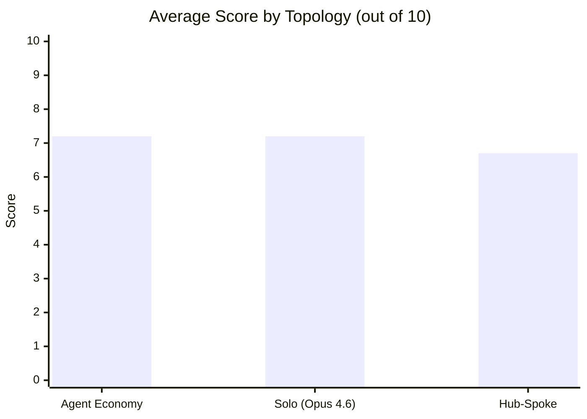

# Hub vs Spoke

When you have access to multiple LLMs, how should you coordinate them? This repo tests three strategies on the same set of tasks and measures what you get for your money.

## Results (Feb 2026, v2)



| Condition | Avg Score | Pass Rate | Total Cost | Score/$ |
|---|---|---|---|---|
| **Agent Economy** | **7.2** | **76%** (34/45) | $1.34 | **5.4** |
| Solo (Opus 4.6) | 7.2 | 73% (33/45) | $1.69 | 4.2 |
| Hub-Spoke | 6.7 | 67% (30/45) | $5.33 | 1.3 |

15 tasks (5 coding, 5 reasoning, 5 synthesis), 3 reps each, 45 scored runs per condition. Bootstrap 95% CIs: market [6.1, 8.2], solo [6.3, 8.0], hub-spoke [5.8, 7.5]. The intervals overlap, so this is still directional — but the pattern is consistent.

The competitive market matched the best single model on quality and cost 21% less. Hub-spoke cost 4x more than either for a lower score.

### What the categories reveal

The headline averages hide real differences by task type:

| Category | Agent Economy | Solo (Opus 4.6) | Hub-Spoke |
|---|---|---|---|
| **Coding** | 6.7 | **8.4** | 7.9 |
| **Reasoning** | **7.1** | 5.1 | 5.2 |
| **Synthesis** | 7.7 | **8.1** | 6.9 |

Solo Opus dominates coding — coordinating multiple models adds noise without helping. The market dominates reasoning, where it scored 7.1 versus 5.1 for solo and 5.2 for hub-spoke. This held on both medium and hard reasoning tasks. Synthesis is close, with solo slightly ahead.

### Hard vs medium tasks

| Difficulty | Agent Economy | Solo (Opus 4.6) | Hub-Spoke |
|---|---|---|---|
| Medium (5 tasks) | 6.9 | 6.7 | 6.7 |
| Hard (10 tasks) | 7.3 | 7.4 | 6.6 |

On hard tasks, the market and solo stayed level while hub-spoke dropped further. The market's reasoning advantage persisted on hard tasks; the solo's coding advantage persisted too.

<details>
<summary>Per-task head-to-head (averaged over 3 reps)</summary>

| Task | Agent Economy | Hub-Spoke | Solo | Best |
|---|---|---|---|---|
| coding-001 | 6.3 | 8.3 | **9.7** | solo |
| coding-002 | **10.0** | 9.7 | 9.3 | tie |
| coding-003 | 1.3 | **6.0** | 5.3 | hub-spoke |
| coding-004 | 9.7 | 9.0 | **10.0** | tie |
| coding-005 | 6.0 | 6.7 | **7.7** | solo |
| reasoning-001 | **10.0** | 0.0 | 0.0 | market |
| reasoning-002 | 6.7 | **9.7** | 9.0 | hub-spoke |
| reasoning-003 | 9.0 | 9.0 | **9.3** | tie |
| reasoning-004 | 3.0 | **4.0** | 3.3 | hub-spoke |
| reasoning-005 | **7.0** | 3.3 | 3.7 | market |
| synthesis-001 | **9.0** | 8.3 | 7.7 | market |
| synthesis-002 | **9.0** | 7.3 | 8.3 | market |
| synthesis-003 | **8.7** | 4.3 | 8.3 | tie |
| synthesis-004 | 6.0 | 6.0 | **7.0** | solo |
| synthesis-005 | 6.0 | 8.3 | **9.0** | solo |

**Wins**: Agent Economy 4, Solo 4, Hub-Spoke 3 (4 ties)

reasoning-001 is the exact-match probability question (10/33). Only the market got it right — both solo and hub-spoke failed all 3 reps. reasoning-004 (logic grid puzzle) was hard for everyone: nobody averaged above 4.

</details>

<details>
<summary>Market internals: routing and reputation</summary>

**Who won the bids?** GPT-5.2 dominated with 28 task wins across the 3 sessions, Opus 4.6 took 11, GPT-5-mini never won a single task. The market effectively learned that mini was unreliable and stopped routing to it.

**Final reputations** (after 15-task sessions): GPT-5.2 = 1.14, Opus 4.6 = 1.18, GPT-5-mini = 1.00. Despite GPT-5.2 winning more tasks, Opus 4.6 maintained slightly higher reputation — its wins were higher-quality.

**Routing accuracy** (5 shadow tasks x 3 reps = 15 checks): 12/15 (80%) of market routing decisions matched the oracle pick (best model determined by running all three). The 3 misses were on reasoning-004 (hard logic puzzle, rep 0) and two cases where the winner was "unknown" (market failed to fill the task).

</details>

<details>
<summary>Shadow counterfactual analysis</summary>

On 5 shadow tasks per rep, all three market workers independently answered the same question. This checks whether the market routed to the best model.

Most tasks showed no regret — the market's pick matched or tied the oracle. The notable miss was reasoning-004 rep 0: the market picked Opus 4.6 (score 3) when GPT-5.2 would have scored 9. On all other reasoning/synthesis shadows, routing was optimal.

Parallel-3-pick baseline (run all three, pick best): on 12/15 shadow runs the market matched it. The 3 misses would have cost $0.15 extra per task to catch by running all models.

</details>

## The three topologies

### Solo

One model answers the task directly. No decomposition, no coordination, no overhead. This is the control — it tells you whether coordination actually helps or whether you're just paying for extra calls.

### Hub-Spoke

An orchestrator (Opus 4.5) decomposes the task, assigns subtasks to three GPT-5.2 workers, synthesises their outputs, then one worker red-teams the synthesis and the hub revises. About 7 LLM calls per task.

```
         +----------+
    +----> Spoke 0  +---+
    |    +----------+   |
    |    +----------+   |    +---------+    +--------+
----+---->   Hub    <---+---->Red-team +---->Revision|
    |    +----------+   |    +---------+    +--------+
    |    +----------+   |
    +----> Spoke 2  +---+
         +----------+
```

### Agent Economy

Three models (GPT-5.2, Opus 4.6, GPT-5-mini) compete through [agent-economy](https://github.com/strangeloopcanon/agent-economy)'s clearinghouse. For each task, all three bid; the engine picks a winner based on bid confidence and reputation; the winner produces an answer; an LLM judge verifies it. Reputation develops across the full 15-task session — early failures reduce a model's chances of winning later tasks.

```
    +----------+   bid    +----------------+   assign   +--------+
    | GPT-5.2  +--------->|                +------------>| Winner |
    +----------+          | Clearinghouse  |             +---+----+
    +----------+   bid    |   Engine       |                 |
    |Opus 4.6  +--------->|                |    verify       v
    +----------+          |  reputation    |<-----------+--------+
    +----------+   bid    |  tracking      |            | Judge  |
    |GPT-mini  +--------->|                |            +--------+
    +----------+          +----------------+
```

## Setup

Python 3.11+. [`uv`](https://docs.astral.sh/uv/) recommended.

```bash
git clone https://github.com/strangeloopcanon/hub-vs-spoke.git
cd hub-vs-spoke
uv pip install -e ".[dev]"

cp .env.example .env
# Fill in OPENAI_API_KEY and ANTHROPIC_API_KEY
```

## Running

```bash
# Preview the matrix without calling any APIs
python scripts/run_benchmark.py --dry-run

# Full run: 3 conditions x 15 tasks x 3 reps + shadow counterfactuals
python scripts/run_benchmark.py --output results/hard_run.jsonl

# Analyse results
python scripts/analyse_results.py results/hard_run.jsonl --csv results/hard_summary.csv

# Unit tests (no API keys needed)
pytest tests/unit/ -v
```

<details>
<summary>CLI options</summary>

```bash
# Single category
python scripts/run_benchmark.py --category coding

# Single config
python scripts/run_benchmark.py --config agent-economy

# Change reps (default: 3)
python scripts/run_benchmark.py --reps 5

# Adjust budget
python scripts/run_benchmark.py --budget-tokens 30000 --budget-turns 20
```

</details>

## Caveats

The bootstrap CIs overlap across all three conditions. This is directional evidence, not proof of superiority. The judge (GPT-5.2) also participates as a market worker, which could introduce bias. GPT-5-mini never won a market bid, so the "three-model market" was effectively a two-model contest. On reasoning-001, the exact-match task, only the market got the right answer — this single task accounts for much of the market's reasoning advantage.

## Next steps

Concrete things to build on these results, roughly in priority order.

1. **Judge independence.** GPT-5.2 serves as both a market worker and the evaluation judge. Replace the judge with a model that doesn't participate (e.g. Claude Sonnet 4.5 or a separate instance with a different system prompt). Then check whether scores change.

2. **Drop GPT-5-mini, add a specialist.** Mini never won a single bid across 45 market tasks. Replace it with a model that's actually competitive, or one with known domain strengths (e.g. a code-specialist model) to test whether the market can learn to route domain tasks to the right specialist.

3. **Longer sessions.** Run 30-50 tasks per market session. The reputation mechanism barely warms up in 15 tasks. With 50, you can plot reputation trajectory over time and see whether it converges to meaningful routing signals.

4. **Structured bids.** Extend agent-economy's bidder to produce structured bids: `{p_success, expected_tokens, plan, risks}`. Track calibration — does stated confidence predict actual performance? This is the data needed to know if market-based routing can be trusted beyond brute-force reputation.

5. **Cost-aware scoring.** Add a condition where the market uses `score = quality / cost` instead of pure quality. See if this routes cheap tasks to cheaper models while preserving quality on hard tasks.

6. **Pairwise judge evaluation.** Add a pairwise comparison mode to the judge (present two answers anonymously, ask which is better) alongside the current absolute scoring. Compare whether pairwise rankings agree with absolute scores.

<details>
<summary>Project structure</summary>

```
src/hub_vs_spoke/
├── types.py                Core data models (Message, Usage, Turn, TopologyResult)
├── config.py               Settings via pydantic-settings (.env)
├── providers/
│   ├── base.py             LLMProvider protocol
│   ├── openai_provider.py  OpenAI chat completions
│   └── anthropic_provider.py  Anthropic messages
├── agents/
│   ├── agent.py            Agent: provider + history + cost tracking
│   └── mock_agent.py       MockAgent for tests (no network)
├── topologies/
│   ├── base.py             Topology protocol
│   ├── _shared.py          Subtask parsing, retry logic, result building
│   ├── hub_spoke.py        Hub-and-spoke + red-team review
│   ├── solo.py             Solo baseline
│   └── market.py           Agent-economy clearinghouse wrapper
├── tasks/
│   ├── base.py             Task model, registry, eval methods
│   ├── coding.py           5 coding tasks (implement, debug, refactor, LRU cache, async bugs)
│   ├── reasoning.py        5 reasoning tasks (probability, scheduling, causal, logic grid, magic square)
│   └── synthesis.py        5 synthesis tasks (consistency, debate, multi-audience, EHR architecture, microservices critique)
└── evaluation/
    ├── judge.py            LLM-as-judge (absolute + pairwise)
    ├── deterministic.py    Exact match, regex, code execution, function-call check
    ├── cost.py             Token-to-USD pricing
    └── reliability.py      Success/error rate scoring

scripts/
├── run_benchmark.py        Benchmark runner (solo, hub-spoke, market + shadows)
└── analyse_results.py      Analysis: calibration, routing accuracy, bootstrap CIs, difficulty breakdown

tests/
├── unit/                   79 tests, no network, < 3 seconds
└── integration/            Pipeline + live API tests
```

</details>

<details>
<summary>Adding tasks</summary>

Create a task in the relevant file (e.g. `src/hub_vs_spoke/tasks/coding.py`):

```python
Task(
    task_id="coding-006",
    category=TaskCategory.CODING,
    prompt="Your task description.",
    eval_method=EvalMethod.LLM_JUDGE,
    eval_rubric="What counts as good. Length alone is not quality.",
    difficulty="hard",
)
```

Append it to the category list and it auto-registers on import.

</details>
