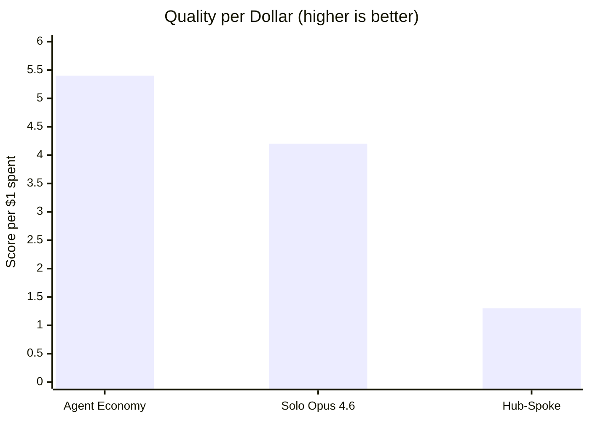
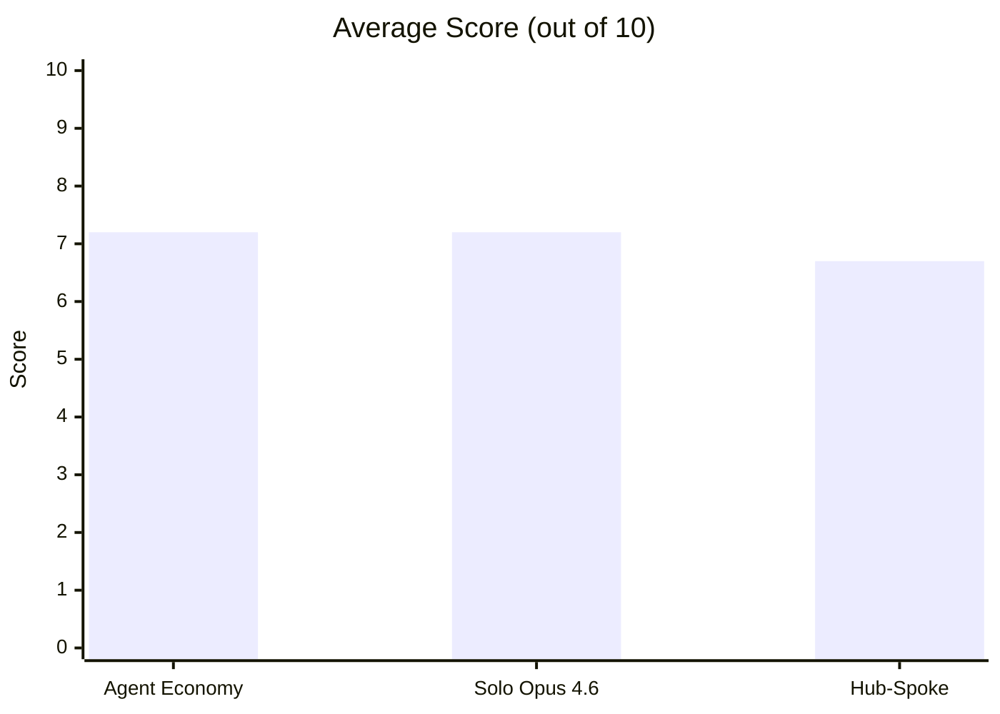
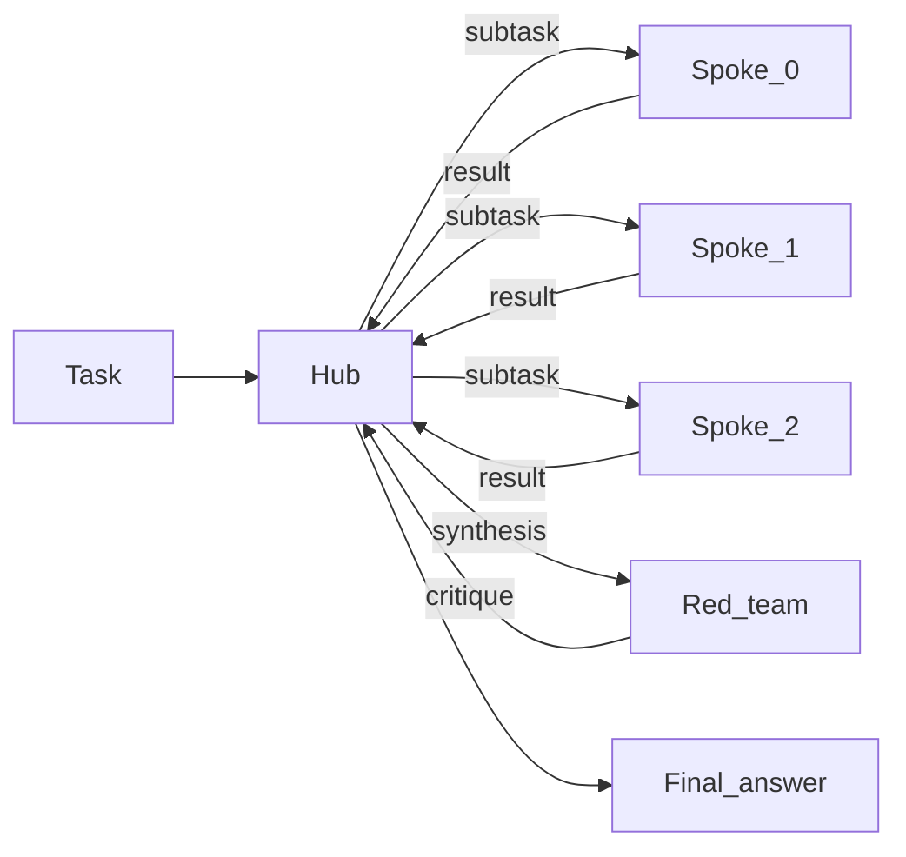
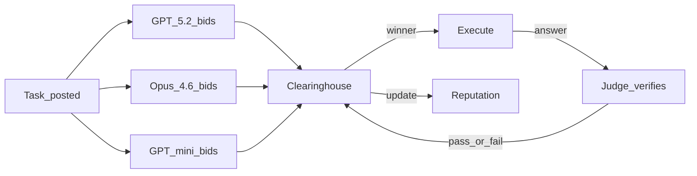

# Hub vs Spoke

If you can call multiple LLMs, is it better to use one strong model, have one orchestrate the others, or let them compete for work? This repo runs all three approaches on the same tasks and tracks what each produces for what it costs.

## Results

We ran two experiments. The pilot (9 tasks, 1 rep) suggested the market was dominant. The full run (15 tasks, 3 reps) showed that was partly a small-sample effect. Both are reported here.

### Full run (15 tasks, 3 reps, 135 scored runs)





| Condition | Avg Score | Pass Rate | Total Cost | Score/$ |
|---|---|---|---|---|
| **Agent Economy** | 7.2 | 76% (34/45) | **$1.34** | **5.4** |
| Solo (Opus 4.6) | 7.2 | 73% (33/45) | $1.69 | 4.2 |
| Hub-Spoke | 6.7 | 67% (30/45) | $5.33 | 1.3 |

The competitive market matched the best single model on quality and cost 21% less. Hub-spoke cost 4x more than either for a lower score. Bootstrap 95% CIs on mean score: market [6.1, 8.2], solo [6.3, 8.0], hub-spoke [5.8, 7.5] — the intervals overlap, so the overall averages are not statistically distinguishable. The category-level patterns below are where the real separation lives.

### When the market wins: reasoning

| | Agent Economy | Solo (Opus 4.6) | Hub-Spoke |
|---|---|---|---|
| **Coding** | 6.7 | **8.4** | 7.9 |
| **Reasoning** | **7.1** | 5.1 | 5.2 |
| **Synthesis** | 7.7 | **8.1** | 6.9 |

The market scored 7.1 on reasoning where solo and hub-spoke both landed around 5. The bidding process appears to function as forced deliberation: models assess the task before attempting it, which helps on problems that punish rushing. The market was the only condition that solved the exact-match probability question (10/33) across all three reps.

### When solo wins: coding

For implementing data structures, debugging, and refactoring, a single strong model beats coordination. Solo Opus scored 8.4; the market managed 6.7. Adding more cooks to the kitchen adds noise without helping.

### When it's close: synthesis

Comparing architectures, constructing arguments, multi-audience explanation — solo edged the market 8.1 to 7.7. Hub-spoke trailed both at 6.9.

### Pilot vs full run

| Metric | Pilot (9 tasks, 1 rep) | Full run (15 tasks, 3 reps) |
|---|---|---|
| Market avg score | **8.8** | 7.2 |
| Solo avg score | 7.2 | 7.2 |
| Hub-spoke avg score | 7.1 | 6.7 |
| Market pass rate | **100%** (9/9) | 76% (34/45) |
| Market total cost | $0.41 | $1.34 |
| Solo total cost | $0.31 | $1.69 |
| Hub-spoke total cost | $1.00 | $5.33 |

The pilot's sample was too small to separate signal from noise. With harder tasks and repetitions, the market's quality edge disappeared — it converged with solo at 7.2. What held up: the market's cost-efficiency advantage (cheapest per quality point in both experiments) and the category-level patterns (market wins reasoning, solo wins coding).

Solo was stable across both experiments: 7.2 in the pilot, 7.2 in the full run. Hub-spoke dropped from 7.1 to 6.7, suggesting the hierarchical approach degrades on harder tasks.

<details>
<summary>Pilot per-task scores (Experiment 1)</summary>

| Task | Agent Economy | Hub-Spoke | Solo |
|---|---|---|---|
| coding-001 (interval store) | 8 | 9 | **10** |
| coding-002 (debug sliding window) | **10** | **10** | **10** |
| coding-003 (refactor monolith) | 7 | **9** | 6 |
| reasoning-001 (combinatorial probability) | **10** | 0 | 0 |
| reasoning-002 (constraint scheduling) | **10** | **10** | 9 |
| reasoning-003 (causal chain) | 9 | 9 | 9 |
| synthesis-001 (distributed consistency) | **9** | 8 | 6 |
| synthesis-002 (monorepo debate) | **9** | 7 | 7 |
| synthesis-003 (multi-audience Raft) | 7 | 2 | **8** |

</details>

<details>
<summary>Full-run per-task scores (Experiment 2, averaged over 3 reps)</summary>

| Task | Agent Economy | Hub-Spoke | Solo | Best |
|---|---|---|---|---|
| coding-001 (interval store) | 6.3 | 8.3 | **9.7** | solo |
| coding-002 (debug sliding window) | **10.0** | 9.7 | 9.3 | tie |
| coding-003 (refactor monolith) | 1.3 | **6.0** | 5.3 | hub-spoke |
| coding-004 (LRU cache) | 9.7 | 9.0 | **10.0** | tie |
| coding-005 (async concurrency bugs) | 6.0 | 6.7 | **7.7** | solo |
| reasoning-001 (combinatorial probability) | **10.0** | 0.0 | 0.0 | market |
| reasoning-002 (constraint scheduling) | 6.7 | **9.7** | 9.0 | hub-spoke |
| reasoning-003 (causal chain analysis) | 9.0 | 9.0 | **9.3** | tie |
| reasoning-004 (logic grid puzzle) | 3.0 | **4.0** | 3.3 | hub-spoke |
| reasoning-005 (constrained magic square) | **7.0** | 3.3 | 3.7 | market |
| synthesis-001 (distributed consistency) | **9.0** | 8.3 | 7.7 | market |
| synthesis-002 (monorepo debate) | **9.0** | 7.3 | 8.3 | market |
| synthesis-003 (multi-audience Raft) | **8.7** | 4.3 | 8.3 | tie |
| synthesis-004 (EHR architecture) | 6.0 | 6.0 | **7.0** | solo |
| synthesis-005 (microservices critique) | 6.0 | 8.3 | **9.0** | solo |

**Task wins**: Agent Economy 4, Solo 4, Hub-Spoke 3 (4 ties)

reasoning-001 is the exact-match probability question (answer: 10/33). Only the market got it right across all reps — solo and hub-spoke failed every time. reasoning-004 (11-constraint logic grid) was hard for everyone; nobody averaged above 4.

</details>

<details>
<summary>Hard vs medium tasks</summary>

| Difficulty | Agent Economy | Solo (Opus 4.6) | Hub-Spoke |
|---|---|---|---|
| Medium (5 tasks) | 6.9 | 6.7 | 6.7 |
| Hard (10 tasks) | 7.3 | 7.4 | 6.6 |

On hard tasks the market and solo held steady while hub-spoke dropped. The category patterns persisted: the market's reasoning edge and solo's coding edge both held on hard tasks.

</details>

<details>
<summary>Market internals: routing and reputation</summary>

The market had three participants: GPT-5.2, Opus 4.6, and GPT-5-mini.

**Who won bids?** GPT-5.2 dominated with 28 task wins across 3 sessions. Opus 4.6 took 11. GPT-5-mini never won a single task — the market learned it was unreliable and stopped routing to it. In economic terms, mini was priced out: its bids couldn't compete on the quality-adjusted margin.

**Reputation at session end**: GPT-5.2 = 1.14, Opus 4.6 = 1.18, GPT-5-mini = 1.00 (unchanged from start). Despite winning fewer tasks, Opus 4.6 maintained slightly higher reputation because its wins were higher-quality — a quality-over-quantity dynamic.

**Routing accuracy**: On 5 shadow tasks per rep (15 total checks), the market's pick matched the oracle (the best model as determined by running all three) 80% of the time (12/15). The 3 misses: one hard logic puzzle where it picked the wrong model (6-point regret), and two tasks where the market failed to fill the task.

**Pilot comparison**: In the pilot, Opus 4.6 won 7/9 tasks and GPT-5.2 won 2/9. In the full run, that flipped — GPT-5.2 won 28/39. The added coding and reasoning tasks favoured GPT-5.2, suggesting the pilot's task mix happened to suit Opus.

</details>

<details>
<summary>Shadow counterfactual analysis</summary>

On 5 shadow tasks per rep, all three market workers independently answered the same question. This checks whether the market routed to the best model.

Most tasks showed no regret — the market's pick matched or tied the oracle. The notable miss was reasoning-004 rep 0: the market picked Opus 4.6 (score 3) when GPT-5.2 would have scored 9. On all other reasoning and synthesis shadows, routing was optimal.

**Parallel-3-pick baseline** (run all three, judge picks best): on 12/15 shadow runs the market matched this baseline. The 3 misses would have cost roughly $0.15 extra per task to catch by running all models.

</details>

## Key takeaways

- **No single topology dominates.** The market wins on reasoning, solo wins on coding, and they tie overall. The right choice depends on what you're doing.
- **Coordination has a cost.** Hub-spoke spent 4x more than solo or market and scored lowest. The overhead of decomposing, delegating, and synthesising didn't pay for itself on any task category.
- **The market's real advantage is efficiency, not quality.** It matched solo's quality at 21% lower cost by routing most tasks to the cheaper model that could handle them.
- **Reputation works as a filter, not a router.** The market learned to exclude the weakest model (GPT-5-mini never won a bid) but didn't learn to match task types to model strengths — GPT-5.2 won most tasks regardless of category.
- **Small samples flatter novel approaches.** The pilot's 8.8 average for the market dropped to 7.2 with more data. Replication matters.

## How it works

### The three strategies

**Solo** — One model (Opus 4.6) answers each task directly. No decomposition, no coordination, no overhead. This is the control condition: it tells you whether coordination helps at all, or whether you're just paying for extra API calls.

**Hub-Spoke** — An orchestrator (Opus 4.5) reads the task, decomposes it into subtasks, assigns each to a GPT-5.2 worker, collects their outputs, synthesises a final answer, then one worker adversarially reviews the synthesis and the hub revises. About 7 LLM calls per task.



**Agent Economy** — Three models (GPT-5.2, Opus 4.6, GPT-5-mini) compete through [agent-economy](https://github.com/strangeloopcanon/agent-economy)'s clearinghouse. For each task, all three submit bids expressing their confidence. The engine picks a winner by weighting bid confidence against reputation. The winner produces an answer. An LLM judge verifies it. If verification fails, another model can attempt the task. Reputation accumulates across the full 15-task session, so early performance affects later routing.



The analogy to labour markets is deliberate. Each task is a contract. Models bid for work. The clearinghouse clears the market by matching tasks to bidders weighted by a quality signal (reputation). Poor performers lose future bids — not through explicit punishment but because their reputation-adjusted bids become uncompetitive. The difference from a real market: there's no actual price — "cost" is the token spend, and "price" is the model's confidence that it can succeed.

There is also a legacy `spoke_spoke` peer-mesh implementation still in the codebase from an earlier iteration of the project. It is kept for comparison and regression tests, but it is not part of the current published benchmark matrix.

### Evaluation

Every answer is scored 0-10 by an LLM judge (GPT-5.2) using a rubric specific to each task. The rubric defines what a good answer looks like, what common mistakes to penalise, and includes an anti-verbosity clause ("length alone is not quality"). One task (reasoning-001, combinatorial probability) uses exact-match grading instead — the answer is either 10/33 or it isn't. "Pass" means score >= 7.

<details>
<summary>What a task looks like</summary>

Here's reasoning-005 ("constrained magic square"):

> Place the digits 1 through 9 in a 3x3 grid so that each row, column, and both main diagonals sum to 15. The top-left cell must contain 2 and the center cell must contain 5. Provide the completed grid and prove it is the ONLY solution satisfying all five constraints.

The rubric: the unique solution is [[2,7,6],[9,5,1],[4,3,8]]. The proof must show that [2,4,9] as the first row forces a cell value of 12, which is impossible. Grid correct but no uniqueness proof caps the score at 5-6. Wrong grid caps at 1-3.

Tasks range from medium (implement an interval store, schedule 6 talks into 3 rooms) to hard (find 3 concurrency bugs in async code, critique the claim that "microservices are always better than monoliths for orgs with 50+ engineers" with real company counterexamples).

</details>

### Why the market is cheaper

Solo runs every task through Opus 4.6, which charges $25 per million output tokens. The market routed 28 of 39 won tasks to GPT-5.2 at $14 per million — it learned that the cheaper model was good enough most of the time. Even with the overhead of bidding, judging, and verification, cheaper per-token rates more than offset the extra volume.

This is the market doing what markets do: finding the efficient allocation. The reputation system acts as a quality signal. The bidding process forces each model to reveal information about its own expected performance. Together they produce a cost-quality frontier that no single model achieves alone — not by being smarter, but by routing cheap tasks cheaply and expensive tasks to the model most likely to succeed.

## Caveats

1. **Judge conflict of interest.** GPT-5.2 is both a market participant and the evaluation judge. If it systematically prefers its own output style, market scores are inflated when GPT-5.2 wins (which it did 28 times).

2. **Three-model market was really two.** GPT-5-mini never won a bid. The market was effectively GPT-5.2 vs Opus 4.6, which limits what we can say about the mechanism's ability to discover specialisation across genuinely different models.

3. **Single task driving reasoning gap.** reasoning-001 (exact-match probability) accounts for a large share of the market's reasoning advantage. It scored 10 where both alternatives scored 0 across all reps. Remove that one task and the reasoning gap narrows considerably.

## Setup

Python 3.11+. [`uv`](https://docs.astral.sh/uv/) recommended.

```bash
git clone https://github.com/strangeloopcanon/hub-vs-spoke.git
cd hub-vs-spoke
uv pip install -e ".[dev]"

cp .env.example .env
# Fill in OPENAI_API_KEY and ANTHROPIC_API_KEY
```

## Running

```bash
# Preview the full matrix without calling any APIs
python scripts/run_benchmark.py --dry-run

# Full run (15 tasks x 3 conditions x 3 reps + shadow counterfactuals)
python scripts/run_benchmark.py --output results/hard_run.jsonl

# Analyse
python scripts/analyse_results.py results/hard_run.jsonl --csv results/hard_summary.csv

# Unit tests (no API keys needed)
pytest tests/unit/ -v
```

<details>
<summary>CLI options</summary>

```bash
# Single category
python scripts/run_benchmark.py --category coding

# Single config
python scripts/run_benchmark.py --config agent-economy

# Change reps (default: 3)
python scripts/run_benchmark.py --reps 5

# Adjust token budget per task
python scripts/run_benchmark.py --budget-tokens 30000 --budget-turns 20
```

</details>

## Next steps

- **Judge independence** — use a non-participant model as judge to check for scoring bias
- **Swap GPT-5-mini for a real competitor** — a code-specialist or math model, so the market can test task-type routing
- **Longer sessions** — 50 tasks per market session to see if reputation converges to meaningful routing
- **Structured bids** — `{confidence, tokens, plan, risks}` instead of a single number; track calibration
- **Cost-aware scoring** — `quality / cost` in the market engine to route cheap tasks cheaply
- **Pairwise evaluation** — present two answers anonymously to check if rankings agree with absolute scores

<details>
<summary>Project structure</summary>

```
src/hub_vs_spoke/
├── types.py                 Core data models, pricing tables
├── config.py                Settings via pydantic-settings (.env)
├── providers/
│   ├── base.py              LLMProvider protocol
│   ├── openai_provider.py   OpenAI chat completions
│   └── anthropic_provider.py Anthropic messages API
├── agents/
│   ├── agent.py             Agent: provider + message history + cost tracking
│   └── mock_agent.py        Deterministic mock for tests
├── topologies/
│   ├── base.py              Topology protocol
│   ├── _shared.py           Subtask parsing, retry logic, result building
│   ├── hub_spoke.py         Hierarchical coordination + red-team step
│   ├── solo.py              Single-model baseline
│   ├── market.py            agent-economy clearinghouse wrapper
│   └── spoke_spoke.py       Legacy peer-mesh topology kept for comparison/tests
├── tasks/
│   ├── base.py              Task model, registry, eval methods
│   ├── coding.py            5 tasks: interval store, debug, refactor, LRU cache, async bugs
│   ├── reasoning.py         5 tasks: probability, scheduling, causal, logic grid, magic square
│   └── synthesis.py         5 tasks: consistency, debate, multi-audience, EHR, microservices
└── evaluation/
    ├── judge.py             LLM-as-judge (absolute scoring)
    ├── deterministic.py     Exact match, regex, code execution
    ├── cost.py              Token-to-USD pricing
    └── reliability.py       Success/error rate

scripts/
├── run_benchmark.py         Runs the benchmark matrix and emits JSONL
└── analyse_results.py       Bootstrap CIs, routing accuracy, calibration, difficulty breakdown

tests/
├── unit/                    84 tests, no network, < 3 seconds
└── integration/             Full pipeline + live API tests
```

</details>

<details>
<summary>Adding tasks</summary>

Create a task in the relevant category file (e.g. `src/hub_vs_spoke/tasks/coding.py`):

```python
Task(
    task_id="coding-006",
    category=TaskCategory.CODING,
    prompt="Your task description here.",
    eval_method=EvalMethod.LLM_JUDGE,
    eval_rubric="Specific criteria for scoring. Length alone is not quality.",
    difficulty="hard",
)
```

Append it to the category list and it registers automatically on import.

</details>
